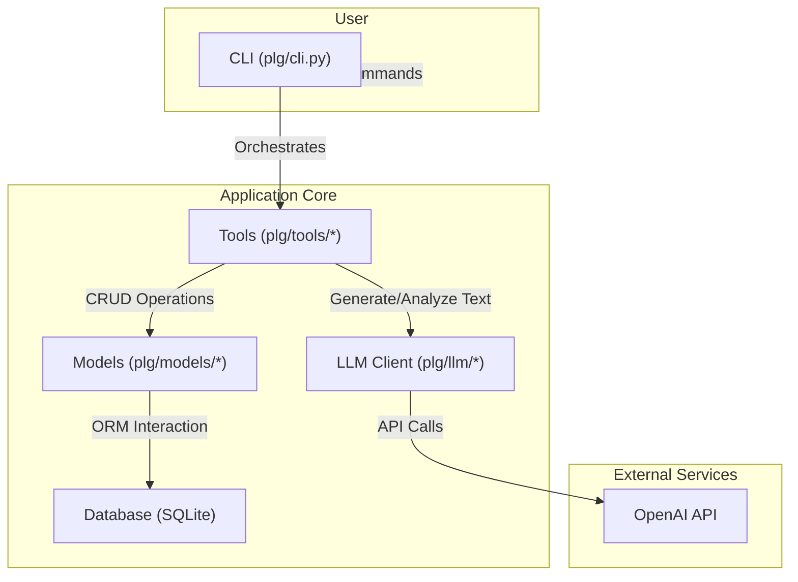

# Parallel Life Generator (PLG)

PLG is a command-line tool that uses the power of Large Language Models (LLMs) to help you explore alternative life paths based on your current situation, goals, and constraints. It takes your context, generates a tree of branching possibilities, and analyzes each path for potential risks, growth opportunities, and emotional resonance.

---

## Architecture

The application is built with a modular architecture, separating concerns for clarity and maintainability.



-   **CLI (`plg/cli.py`)**: The entry point for all user interactions, built with `Typer`.
-   **Tools (`plg/tools/`)**: Contains the core business logic for context collection, tree expansion, analysis, and exporting.
-   **LLM (`plg/llm/`)**: An abstraction layer for interacting with different LLM providers. Currently supports OpenAI.
-   **Models (`plg/models/`)**: Defines the database schema using `SQLModel`, representing decisions and their relationships as a tree structure.
-   **Database**: A simple SQLite database stored in `~/.plg/plg.db`.

---

## Features

-   **Interactive Context Collection**: Guides you through a series of questions to build a rich picture of your starting point.
-   **Autonomous Tree Expansion**: Recursively generates a tree of branching life paths to a specified depth.
-   **AI-Powered Analysis**: Each decision node is automatically tagged with assessments of risk, growth potential, and emotional sentiment.
-   **Multiple Export Formats**: View your decision tree directly in the CLI, or export it to Markdown or a Mermaid graph for easy sharing and visualization.
-   **Node Limit Safeguards**: Prevents runaway generation with a configurable node limit.
-   **CI/CD Integration**: Includes a GitHub Actions workflow for automated linting and testing.

---

## Quickstart

### Prerequisites

-   Python 3.9+
-   [Poetry](https://python-poetry.org/docs/#installation) for dependency management.

### 1. Installation

Clone the repository and install the dependencies:

```bash
git clone https://github.com/your-username/parallel-life-generator.git
cd parallel-life-generator
poetry install
```

### 2. Configuration

The application requires an OpenAI API key. Create a `.env` file in the project root with the following content:

```
# .env
OPENAI_API_KEY="sk-..."
```
Replace `sk-...` with your actual OpenAI API key.

### 3. Usage

The main entry point is the `plg launch` command. This will start an interactive session to collect your context and then automatically build the decision tree.

```bash
poetry run plg launch --depth 2 --children 2 --export markdown
```

This command will:
1.  Ask you a series of questions.
2.  Generate a decision tree of depth 2, with 2 children per node.
3.  Export the final tree to a timestamped Markdown file in `~/plg_sessions/`.

---

## Commands

Here are the main commands available:

| Command                                               | Description                                                                                                   |
| ----------------------------------------------------- | ------------------------------------------------------------------------------------------------------------- |
| `plg launch [--depth D] [--children C] [--export F]` | Starts a full, interactive session to create and optionally export a new tree.                                  |
| `plg collect`                                         | Runs only the interactive context collection and saves the result as a new root decision.                     |
| `plg expand <id> [--depth D] [--children C]`          | Expands an existing decision tree from a given Decision ID.                                                   |
| `plg show <id>`                                       | Displays a decision tree in the terminal in a UI-friendly format.                                             |
| `plg export <id> <file> [--format F]`                 | Exports a tree to a specified file. Formats are `markdown` or `mermaid`.                                        |
| `plg summarise <id>`                                  | Generates and prints a summary for the context of a given decision.                                           |
| `plg annotate <id>`                                   | Generates and prints strategic tags for a given decision.                                                     |

### Sample Output (`plg show 8`)

Here's an example of what the tree looks like in your terminal:

```
Decision Tree starting from Decision ID: 8
└── Decision (ID: 8): Initial context collected.
    Tags: [Risk: Low] [Growth: Low] [Emotion: N/A]
    ├── Decision (ID: 9): Path One: Start by leveraging your current job as a learning ground for enhancing 
    │   your skills in data analysis and project management...
    │   Tags: [Risk: Medium] [Growth: High] [Emotion: Ambitious]
    └── Decision (ID: 10): Path Two: Enroll in an online MBA or a relevant certification program focusing on
        entrepreneurship or consulting to expand your knowledge and network...
        Tags: [Risk: Medium] [Growth: High] [Emotion: Ambitious]
```

---

## Development

This project uses `ruff` for linting and `black` for code formatting. A `Makefile` is provided for convenience.

-   **Install dependencies**: `poetry install`
-   **Run linters**: `make lint`
-   **Auto-format code**: `make format`
-   **Run tests**: `make test`

The CI/CD pipeline is defined in `.github/workflows/ci.yml` and runs these checks automatically on every push and pull request.
